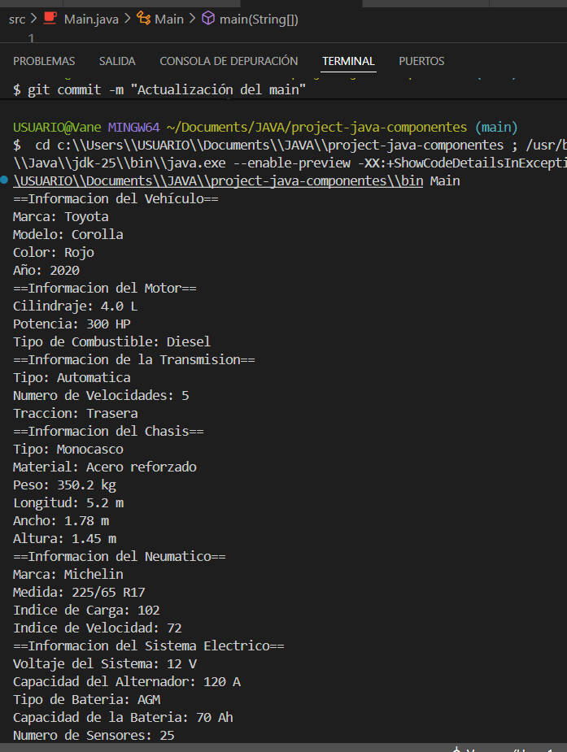
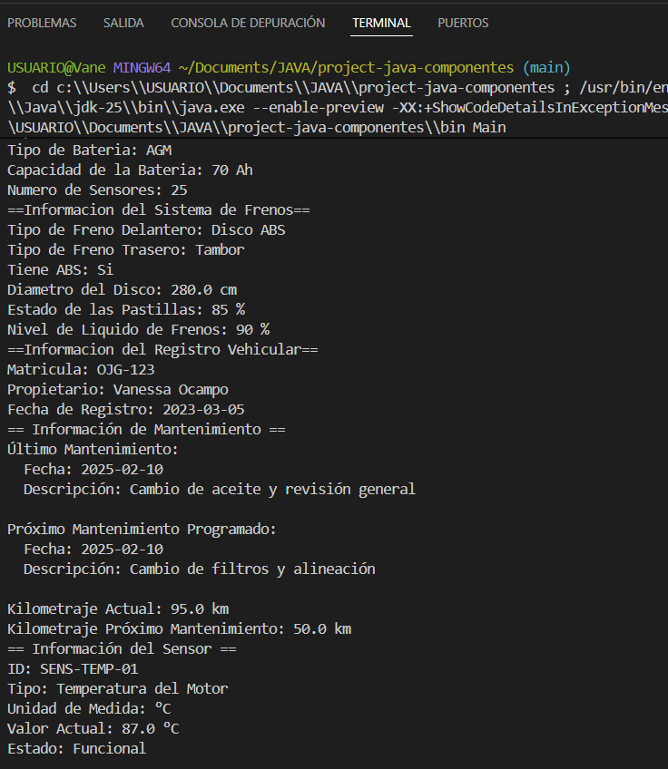

## Nombre del proyecto
project-java-componentes

## Descripción general

Este proyecto desarrolla un sistema en Java basado en programación orientada a objetos, con el propósito de representar de forma estructurada y funcional los principales componentes de un vehículo. Se han diseñado clases específicas para elementos como el motor, chasis, transmisión, frenos, neumáticos, sensores, sistema eléctrico, registro vehicular y mantenimiento, cada una con atributos y métodos que reflejan su rol dentro del funcionamiento general del vehículo.

En el método principal (main), se instancian objetos de estas clases y se visualizan sus datos en consola, permitiendo validar su comportamiento y facilitar la comprensión del modelo. Esta implementación busca no solo fortalecer el dominio técnico en Java, sino también fomentar una visión integral del diseño de sistemas complejos mediante la modularidad y la claridad estructural.

## Diagrama o descripción especifica 

Diagrama o descripción de las clases y sus relaciones Clases principales:

* Vehiculo Atributos generales de cualquier vehículo: marca, modelo, año, color, peso, etc.
* Motor Tipo de motor, cilindrada, caballos de fuerza, consumo, etc.
* Transmision Tipo de transmisión, número de marchas y relación.
* Chasis Material, dimensiones, peso estructural.
* Neumatico Tipo de caucho, tamaño, presión recomendada.
* SistemaFrenos Tipo de frenos y eficiencia.
* SistemaElectrico Voltaje, capacidad, tipo de batería.
* Sensor Modela sensores individuales del vehículo (velocidad, temperatura, presión, etc).
* Mantenimiento Historial y programación de mantenimientos realizados.
* RegistroVehicular Matrícula, propietario y fecha de registro.
 